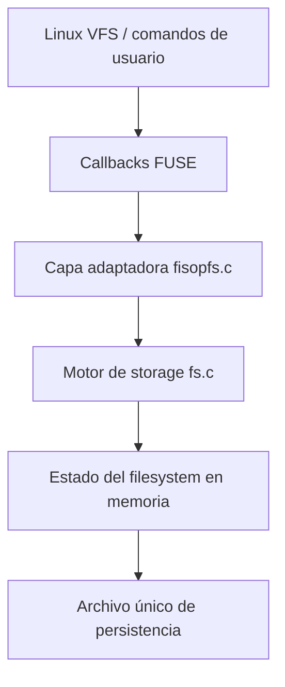
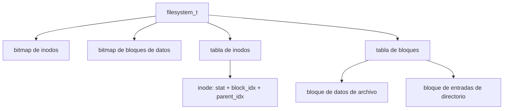
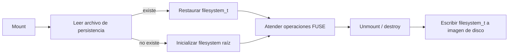

<p align="right">
  <a href="README.md">🇺🇸 English</a> | <strong>🇦🇷 Español</strong>
</p>

# FUSE FileSystem — fisopfs

<div align="center">


</div>

---

Un filesystem persistente pequeño implementado en C con FUSE, diseñado para exponer operaciones reales de filesystem desde userspace mientras administra su propia tabla de inodos, bloques de datos, entradas de directorio, metadata y serialización en disco.

## Highlights

> Proyecto de backend/sistemas enfocado en modelado de storage de bajo nivel, interfaces de sistema operativo, persistencia de estado y comportamiento seguro frente a errores.

- **Filesystem implementado en userspace**: se integra con Linux mediante FUSE y traduce callbacks del kernel a un motor de storage propio.
- **Modelo custom de inodos y bloques**: mantiene bitmaps de inodos, bitmaps de bloques de datos, metadata de inodos, entradas de directorio y contenido de archivos en una única estructura en memoria.
- **Persistencia en un único archivo**: serializa el estado completo del filesystem en un archivo de disco al desmontar y lo restaura en el siguiente montaje.
- **Resolución de árbol de directorios**: resuelve paths absolutos recorriendo dentries desde el inodo raíz, siguiendo un modelo similar al de filesystems Unix.
- **Operaciones y errores estilo POSIX**: implementa create, read, write, truncate, mkdir, rmdir, unlink, getattr, readdir y utimens con semántica estándar de errno.
- **Workflow containerizado**: incluye un entorno Docker con FUSE, GCC, Make, GDB, Valgrind y herramientas de formato.
- **Automatización de calidad**: integra clang-format y un workflow de GitHub Actions con pre-commit.

---

## Qué es

**fisopfs** es un filesystem basado en FUSE desarrollado para la materia Sistemas Operativos de la Universidad de Buenos Aires.

El proyecto monta un directorio y atiende requests de filesystem desde una capa de storage propia en C, en lugar de delegar el comportamiento al filesystem host. Archivos, directorios, metadata y estado de asignación se guardan dentro de una estructura compacta en memoria y se persisten por defecto en un archivo llamado `persistence_file.fisopfs`.

Para un portfolio backend, lo interesante no es el tamaño del proyecto. Es la superficie de ingeniería: programación de sistemas con estado, comportamiento expuesto a syscalls, persistencia, manejo explícito de errores, decisiones de layout de datos y reproducibilidad con Docker.

---

## Por qué importa

Los filesystems son infraestructura backend en una de sus formas más fundamentales: reciben requests, validan invariantes, mutan estado durable y exponen un contrato predecible a sus clientes.

Este proyecto demuestra habilidades usadas en servicios backend, pero más cerca del sistema operativo:

- modelado de datos bajo límites estrictos
- transiciones de estado con requisitos de consistencia
- parsing de paths y lookup jerárquico
- persistencia y recuperación
- propagación cuidadosa de errores
- tooling Linux y desarrollo containerizado
- debugging de comportamiento de bajo nivel con estructuras determinísticas

---

## Capacidades

### Capa de Operaciones FUSE

La interfaz pública del filesystem vive en `fisopfs/fisopfs.c`. Allí se registran los callbacks de FUSE y cada request se delega al motor interno de storage en `fisopfs/fs.c`.

Operaciones FUSE implementadas:

- `getattr`: devuelve metadata de archivos o directorios
- `readdir`: lista entradas de directorio
- `read`: lee contenido de archivos con soporte de offset
- `write`: escribe contenido de archivos con soporte de offset
- `create`: crea archivos regulares
- `mkdir`: crea directorios
- `unlink`: elimina archivos regulares
- `rmdir`: elimina directorios vacíos
- `truncate`: cambia el tamaño de un archivo
- `utimens`: actualiza timestamps de acceso y modificación
- `init`: carga o inicializa el estado del filesystem
- `destroy`: persiste el estado del filesystem antes de cerrar



### Modelo Custom de Filesystem

El modelo interno está inspirado en un filesystem Unix-like muy simple.

Todo el filesystem se representa con una estructura `filesystem_t` que contiene:

- un bitmap de asignación de inodos
- un bitmap de asignación de bloques de datos
- una tabla de inodos
- una tabla de bloques

Cada inodo guarda:

- metadata POSIX mediante `struct stat`
- el índice de su bloque asignado
- el índice de su inodo padre

Cada bloque puede representar:

- datos de archivo para archivos regulares
- entradas de directorio para directorios



### Resolución de Paths

Los paths se resuelven desde el inodo raíz. Para un path como `/docs/readme.txt`, el motor:

1. empieza en el inodo `0`, que siempre es el directorio raíz
2. busca `docs` dentro de sus entradas de directorio
3. sigue la entrada encontrada hacia el siguiente inodo
4. busca `readme.txt` dentro de ese directorio
5. devuelve el índice del inodo final o `ENOENT`

Esto mantiene la lógica de lookup explícita y fácil de razonar. El inodo raíz funciona como ancla implícita del superbloque.

### Estrategia de Persistencia

La persistencia es intencionalmente simple y determinística:

- Al inicializar, el filesystem intenta leer el archivo de persistencia configurado.
- Si el archivo no existe, se crea un filesystem limpio con solo el directorio raíz.
- Al cerrar, la estructura `filesystem_t` completa se escribe a disco con `O_CREAT | O_WRONLY | O_TRUNC`.



No es un filesystem productivo con journaling, pero sí una implementación clara de recuperación de estado durable para un motor de storage educativo.

### Asignación y Semántica de Directorios

El filesystem tiene límites fijos de capacidad:

- `MAX_FILES`: 1024 inodos y 1024 bloques de datos
- `MAX_DENTRIES`: 16 entradas por directorio
- `MAX_FILE_SIZE`: 4096 bytes por archivo
- `MAX_FILE_NAME`: 248 bytes por nombre de entrada

Los inodos y bloques libres se encuentran con scans lineales sobre bitmaps. Las entradas de directorio usan `.` y `..` en los primeros dos slots, y las entradas libres se marcan con `-1`.

La eliminación mantiene las entradas compactas desplazando las siguientes hacia la izquierda, lo que simplifica la iteración de directorios: se recorre hasta la primera entrada libre.

### Manejo de Errores

La implementación devuelve valores negativos de errno, como espera FUSE.

Ejemplos:

- `ENOENT` cuando un path no puede resolverse
- `ENOTDIR` cuando un componente esperado como directorio no lo es
- `EISDIR` cuando se intenta leer o eliminar un directorio como archivo
- `ENOTEMPTY` cuando se intenta eliminar un directorio no vacío
- `ENOSPC` cuando no hay inodos, bloques o entradas de directorio disponibles
- `EFBIG` cuando una escritura supera el tamaño máximo de archivo
- `EINVAL` para truncaciones u offsets inválidos

---

## Complejidad Técnica

- Integración de callbacks FUSE con un motor de storage propio
- Administración manual de inodos, bloques y entradas de directorio en C
- Lookup jerárquico de paths sin depender del filesystem host
- Mutación de estado en memoria con bitmaps explícitos de asignación
- Gestión de metadata mediante `struct stat`
- Actualización de timestamps en lecturas, escrituras, truncado y `utimens`
- Persistencia y recuperación en un único archivo
- Entorno Linux containerizado con acceso al dispositivo FUSE
- Build, formato y workflows Docker basados en Makefile
- Checks de formato en CI mediante pre-commit y GitHub Actions

---

## Estructura del Proyecto

```text
.
├── README.md
├── README.es.md
├── .github/
│   └── workflows/
│       └── pre-commit-check.yaml
└── fisopfs/
    ├── Dockerfile
    ├── Makefile
    ├── fisopfs.c
    ├── fs.c
    ├── fisopfs.md
    └── imgs/
```

Archivos clave:

- `fisopfs/fisopfs.c`: capa adaptadora de FUSE y parsing de `--filedisk`
- `fisopfs/fs.c`: estado del filesystem, asignación, operaciones, persistencia y recorrido de paths
- `fisopfs/Makefile`: comandos de build, clean, formato y Docker
- `fisopfs/Dockerfile`: imagen de desarrollo basada en Ubuntu con FUSE y herramientas de debugging
- `.github/workflows/pre-commit-check.yaml`: workflow de CI para pre-commit
- `fisopfs/fisopfs.md`: informe académico original en español

---

## Quick Start

### Requisitos

- Entorno Linux con soporte FUSE
- GCC
- Make
- `pkg-config`
- `libfuse-dev`
- Docker, opcional pero recomendado para setup reproducible

### Build

```bash
cd fisopfs
make
```

### Montaje

Crear un punto de montaje:

```bash
mkdir prueba
```

Iniciar el filesystem:

```bash
./fisopfs prueba/
```

Usar un archivo de persistencia custom:

```bash
./fisopfs prueba/ --filedisk custom_disk.fisopfs
```

Archivo de persistencia por defecto:

```text
persistence_file.fisopfs
```

### Prueba

En otra terminal:

```bash
cd fisopfs/prueba
touch hello.txt
echo "hello filesystem" > hello.txt
cat hello.txt
mkdir docs
ls -la
stat hello.txt
```

### Desmontaje

```bash
sudo umount prueba
```

Al desmontar, el estado del filesystem se escribe en el archivo de persistencia configurado.

---

## Workflow Docker

Construir la imagen de desarrollo:

```bash
cd fisopfs
make docker-build
```

Ejecutar el contenedor:

```bash
make docker-run
```

Dentro del contenedor:

```bash
make
mkdir prueba
./fisopfs -f prueba
```

Adjuntarse desde otra terminal:

```bash
make docker-attach
```

El contenedor se inicia con:

- `/dev/fuse` montado
- capability `SYS_ADMIN`
- AppArmor en modo unconfined
- el directorio del proyecto montado en `/fisopfs`

---

## Comandos de Desarrollo

```bash
# Compilar
make

# Formatear archivos C
make format

# Eliminar binario generado y artefactos de debug
make clean

# Construir imagen Docker
make docker-build

# Ejecutar contenedor Docker
make docker-run

# Adjuntarse al contenedor activo
make docker-attach
```

---

## Límites Conocidos

Este proyecto prioriza claridad sobre features propias de un filesystem productivo.

- Estructuras de tamaño fijo
- Tamaño máximo de archivo de 4096 bytes
- Máximo de 16 entradas por directorio
- Un único bloque por archivo
- Sin journaling ni protocolo de consistencia ante crashes
- Sin enforcement real de permisos más allá de la metadata almacenada
- Sin sincronización interna para accesos concurrentes
- Persistencia por serialización completa de la estructura, no como formato portable de disco

Estas restricciones hacen que la implementación sea fácil de inspeccionar y útil como muestra de programación de sistemas.

---

## Estado

**Proyecto académico de sistemas completo**. El repositorio es útil como showcase orientado a backend sobre internals de filesystems, programación en C, interfaces Linux y pensamiento de infraestructura de sistemas.

El proyecto fue desarrollado originalmente para una materia de Sistemas Operativos de la Universidad de Buenos Aires. Se conserva como una demostración compacta de diseño de storage de bajo nivel, comportamiento de filesystems en userspace y manejo de estado durable.

---

> **Nota:** Este proyecto no es un reemplazo productivo de un filesystem FUSE. Es una implementación enfocada en demostrar fundamentos de sistemas operativos con código C limpio e inspeccionable.
