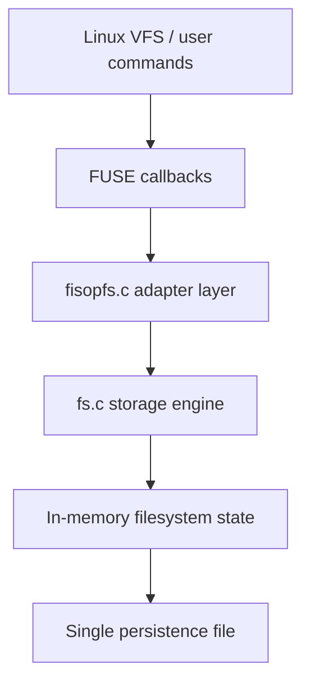
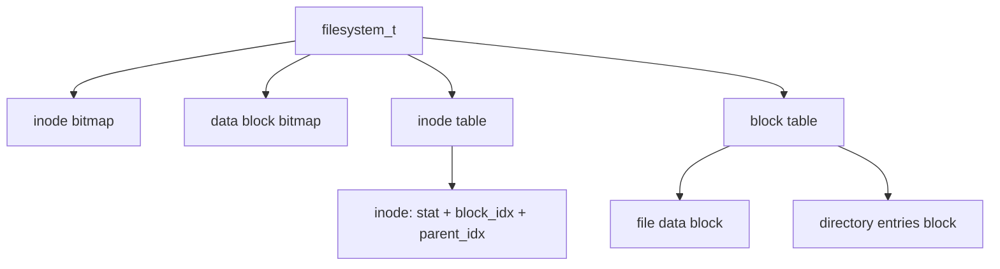
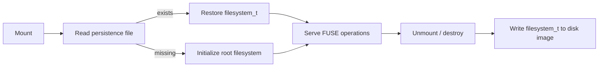

<p align="right">
  <strong>🇺🇸 English</strong> | <a href="README.es.md">🇦🇷 Español</a>
</p>

# FUSE FileSystem — fisopfs

<div align="center">


</div>

---

A small persistent filesystem implemented in C with FUSE, designed to expose real filesystem operations from userspace while managing its own inode table, data blocks, directory entries, metadata, and on-disk serialization.

## Highlights

> Backend systems project focused on low-level storage modeling, operating-system interfaces, state persistence, and error-safe filesystem behavior.

- **Userspace filesystem implementation**: integrates with Linux through FUSE and maps kernel filesystem callbacks to a custom internal storage engine.
- **Custom inode and block model**: keeps inode bitmaps, data block bitmaps, inode metadata, directory entries, and file payloads in a single in-memory filesystem structure.
- **Persistent single-file storage**: serializes the full filesystem state into a disk image file on unmount and restores it on the next mount.
- **Directory tree resolution**: resolves absolute paths by traversing directory entries from the root inode, similar to the conceptual model used by Unix filesystems.
- **POSIX-style operations and errors**: implements create, read, write, truncate, mkdir, rmdir, unlink, getattr, readdir, and utimens with standard errno semantics.
- **Containerized development workflow**: ships with a Docker environment configured with FUSE, GCC, Make, GDB, Valgrind, and formatting tools.
- **Code quality automation**: includes clang-format integration and a GitHub Actions pre-commit workflow.

---

## What It Is

**fisopfs** is a FUSE-based filesystem built for the Operating Systems course at the University of Buenos Aires.

The project mounts a directory and serves filesystem requests from a custom C storage layer instead of delegating them to the host filesystem. Files, directories, metadata, and allocation state are stored inside a compact in-memory structure and persisted to a single file named `persistence_file.fisopfs` by default.

The interesting part is not the size of the project. It is the engineering surface: stateful systems programming, syscall-facing behavior, persistence, explicit error handling, data layout decisions, and Docker-based reproducibility.

---

## Why it matters

Filesystems are backend infrastructure in one of their most fundamental forms: they receive requests, validate invariants, mutate durable state, and expose a predictable contract to clients.

This project demonstrates the same skills used in backend services, but closer to the operating system:

- data modeling under strict limits
- state transitions with consistency requirements
- path parsing and hierarchical lookup
- persistence and recovery
- careful error propagation
- Linux tooling and containerized development
- debugging low-level behavior with deterministic structures

---

## Capabilities

### FUSE Operation Layer

The public filesystem interface lives in `fisopfs/fisopfs.c`. It registers FUSE callbacks and delegates each request to the internal storage engine in `fisopfs/fs.c`.

Implemented FUSE operations:

- `getattr`: returns file or directory metadata
- `readdir`: lists directory entries
- `read`: reads file content with offset support
- `write`: writes file content with offset support
- `create`: creates regular files
- `mkdir`: creates directories
- `unlink`: removes regular files
- `rmdir`: removes empty directories
- `truncate`: changes file size
- `utimens`: updates access and modification timestamps
- `init`: loads or initializes filesystem state
- `destroy`: persists filesystem state before shutdown



### Custom Filesystem Model

The internal model is inspired by a very simple Unix-like filesystem.

The entire filesystem is represented by one `filesystem_t` structure containing:

- an inode allocation bitmap
- a data block allocation bitmap
- an inode table
- a block table

Each inode stores:

- POSIX metadata through `struct stat`
- the index of its assigned block
- the index of its parent inode

Each block can represent either:

- file data for regular files
- directory entries for directories



### Path Resolution

Paths are resolved from the root inode. For a path such as `/docs/readme.txt`, the engine:

1. starts at inode `0`, which is always the root directory
2. scans its directory entries for `docs`
3. follows the matching entry to the next inode
4. scans that directory for `readme.txt`
5. returns the final inode index or `ENOENT`

This keeps lookup logic explicit and easy to reason about. The root inode acts as an implicit superblock anchor.

### Persistence Strategy

Persistence is intentionally simple and deterministic:

- On initialization, the filesystem tries to read the configured persistence file.
- If no persistence file exists, a clean filesystem is created with only the root directory.
- On shutdown, the full `filesystem_t` structure is written to disk with `O_CREAT | O_WRONLY | O_TRUNC`.



This is not a production journaling filesystem, but it is a clear implementation of durable state recovery for an educational storage engine.

### Allocation and Directory Semantics

The filesystem has fixed capacity limits:

- `MAX_FILES`: 1024 inodes and 1024 data blocks
- `MAX_DENTRIES`: 16 directory entries per directory
- `MAX_FILE_SIZE`: 4096 bytes per file
- `MAX_FILE_NAME`: 248 bytes per entry name

Free inodes and blocks are found through linear bitmap scans. Directory entries use `.` and `..` in the first two slots, and free entries are marked with `-1`.

Deletion keeps directory entries compact by shifting later entries left, which makes directory iteration straightforward: scan until the first free entry.

### Error Handling

The implementation returns standard negative errno values expected by FUSE callers.

Examples:

- `ENOENT` when a path cannot be resolved
- `ENOTDIR` when a path component expected to be a directory is not one
- `EISDIR` when trying to read or unlink a directory as a file
- `ENOTEMPTY` when removing a non-empty directory
- `ENOSPC` when no inode, block, or directory entry is available
- `EFBIG` when a write exceeds the maximum file size
- `EINVAL` for invalid truncation or offset conditions

---

## Technical Complexity

- FUSE callback integration with a custom storage engine
- Manual inode, block, and directory-entry management in C
- Hierarchical path lookup without relying on the host filesystem
- In-memory state mutation with explicit allocation bitmaps
- Metadata management through `struct stat`
- Timestamp updates for reads, writes, truncation, and `utimens`
- Single-file persistence and recovery
- Dockerized Linux environment with FUSE device access
- Makefile-based build, formatting, and container workflows
- CI formatting checks through pre-commit and GitHub Actions

---

## Project Structure

```text
.
├── README.md
├── README.es.md
├── .github/
│   └── workflows/
│       └── pre-commit-check.yaml
└── fisopfs/
    ├── Dockerfile
    ├── Makefile
    ├── fisopfs.c
    ├── fs.c
    ├── fisopfs.md
    └── imgs/
```

Key files:

- `fisopfs/fisopfs.c`: FUSE adapter layer and command-line parsing for `--filedisk`
- `fisopfs/fs.c`: filesystem state, allocation, operations, persistence, and path traversal
- `fisopfs/Makefile`: build, clean, format, and Docker commands
- `fisopfs/Dockerfile`: Ubuntu-based development image with FUSE and debugging tools
- `.github/workflows/pre-commit-check.yaml`: CI workflow for pre-commit checks
- `fisopfs/fisopfs.md`: original academic design report in Spanish

---

## Quick Start

### Requirements

- Linux environment with FUSE support
- GCC
- Make
- `pkg-config`
- `libfuse-dev`
- Docker, optional but recommended for reproducible setup

### Build

```bash
cd fisopfs
make
```

### Mount

Create a mount point:

```bash
mkdir prueba
```

Start the filesystem:

```bash
./fisopfs prueba/
```

Use a custom persistence file:

```bash
./fisopfs prueba/ --filedisk custom_disk.fisopfs
```

Default persistence file:

```text
persistence_file.fisopfs
```

### Test

In another terminal:

```bash
cd fisopfs/prueba
touch hello.txt
echo "hello filesystem" > hello.txt
cat hello.txt
mkdir docs
ls -la
stat hello.txt
```

### Unmount

```bash
sudo umount prueba
```

On unmount, the filesystem state is written to the configured persistence file.

---

## Docker Workflow

Build the development image:

```bash
cd fisopfs
make docker-build
```

Run the container:

```bash
make docker-run
```

Inside the container:

```bash
make
mkdir prueba
./fisopfs -f prueba
```

Attach from another terminal:

```bash
make docker-attach
```

The container is started with:

- `/dev/fuse` mounted
- `SYS_ADMIN` capability
- AppArmor unconfined mode
- the project directory mounted into `/fisopfs`

---

## Development Commands

```bash
# Build
make

# Format C files
make format

# Remove generated binary and debug artifacts
make clean

# Build Docker image
make docker-build

# Run Docker container
make docker-run

# Attach to running container
make docker-attach
```

---

## Known Limits

This project intentionally favors clarity over production-grade filesystem features.

- Fixed-size filesystem structures
- Maximum file size of 4096 bytes
- Maximum 16 directory entries per directory
- Single block per file
- No journaling or crash-consistency protocol
- No permission enforcement beyond stored metadata
- No concurrent access synchronization inside the storage engine
- Persistence is full-structure serialization, not a portable disk format

These constraints make the implementation easier to inspect and useful as a systems-programming showcase.

---

## Status

**Complete academic systems project**. The repository is useful as a backend-oriented showcase of filesystem internals, C programming, Linux interfaces, and systems infrastructure thinking.

The project was originally developed for an Operating Systems course at the University of Buenos Aires. It is preserved as a compact demonstration of low-level storage design, userspace filesystem behavior, and durable state management.

---

> **Note:** This is not a production FUSE filesystem replacement. It is a focused implementation built to demonstrate operating system fundamentals with clean, inspectable C code.
