# Informe

## Diseño

### Estructuras en memoria

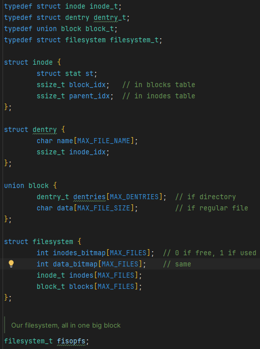

Basamos el filesystem en el very simple filesystem (vsfs), en donde tenemos dos bitmaps, uno de inodos
y el otro de bloques de datos, los cuales indican si un inodo o un bloque de datos está ocupado o no.
Y, por otro lado, tenemos la tabla de inodos y la tabla de bloques de datos, en donde se almacenan los inodos y los
datos
respectivamente.
El superbloque en el caso de nuestro filesystem es implícito, ya que por ejemplo la raiz siempre es el
inodo 0.
Los inodos pueden ser de tipo regular o directorio, en cuyo caso apuntaran a datos o dentries respectivamente. Y cada
dentry apuntará a un inodo.

### Ejemplo de file system

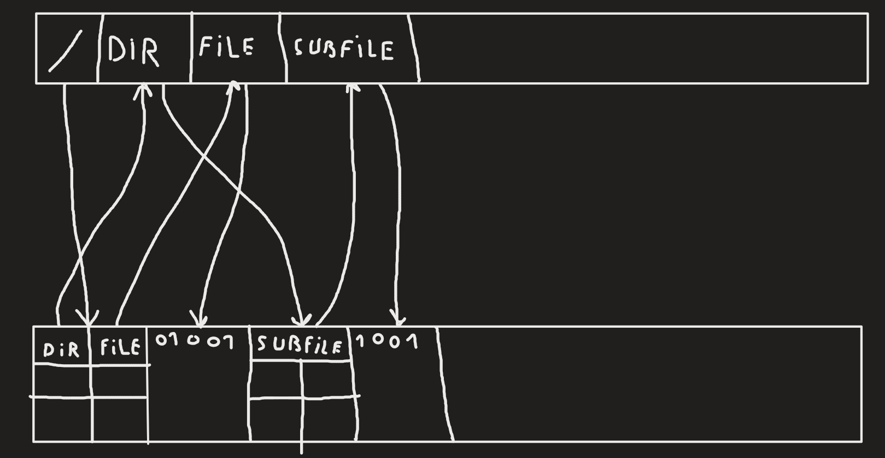
En este ejemplo, tenemos un filesystem con 4 inodos, 2 de tipo directorio y 2 de tipo regular. El inodo 0 es la raiz,
la cual apunta a un conjunto de dentries, de los cuales el primero (dir) apunta a un directorio y el segundo (file)
apunta a un archivo.
Ese archivo apunta a su vez a un bloque de datos, en donde se almacena el contenido del archivo. Por su parte, el
directorio apunta a otro conjunto de dentries de los cuales el primero (subfile) apunta a un archivo de tipo regular que
apunta a su bloque de datos

Representación en forma de arbol:

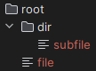

### Busqueda de archivos

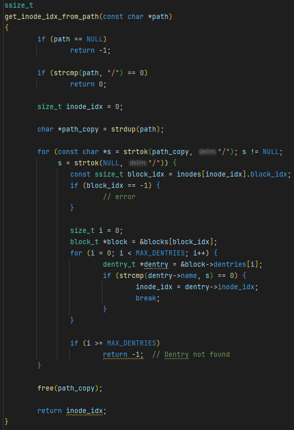

La busqueda de archivos consiste en ir resolviendo los nombres de un path buscandolos en los dentries de cada inodo de
tipo directorio empezando desde la raiz.
Por ejemplo si se quiere buscar el archivo /dir/subfile, se accede al inodo raiz, se busca dentro de sus dentries si
alguno tiene el nombre "dir", si se lo encuentra, se accede al inodo al que apunta ese dentry y se repite el proceso
para subfile.

### Serialización en disco

Para guardar el filesystem en disco, simplemente se escribe toda la estructura de datos filesystem en un archivo. Para
recuperar el file system, se lee todo el contenido del archivo y se lo copia a la estructura de datos filesystem.

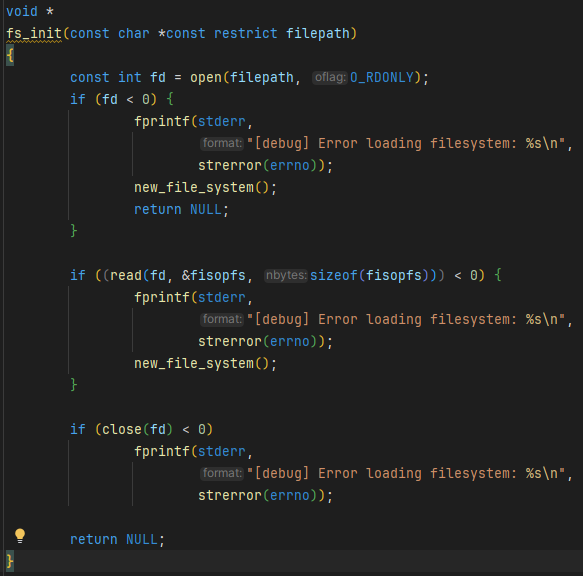
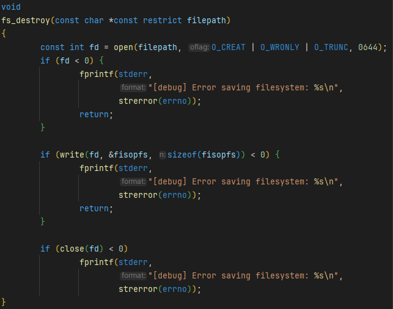

### Información relevante sobre la implementación

Cualquier dentry que no apunte a un inodo válido apunta a -1. Y a la hora de eliminar un dentry, se hace de forma
ordenada para que recorrer la tabla de dentries de un inodo sea simplemente recorrer hasta el primer inodo inválido.

## Pruebas

### Crear archivo en directorio

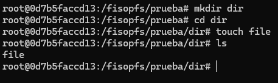

### Crear archivo, escribir y appendear texto

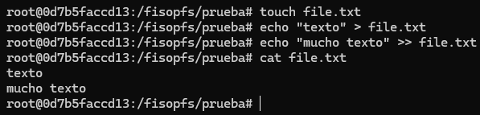

### Crear directorio y archivo

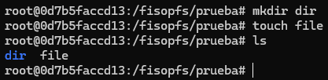

### Directorios especiales

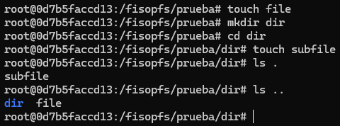

### Less

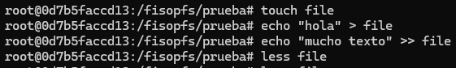
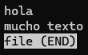

### More

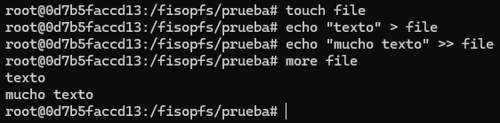

### Persistencia

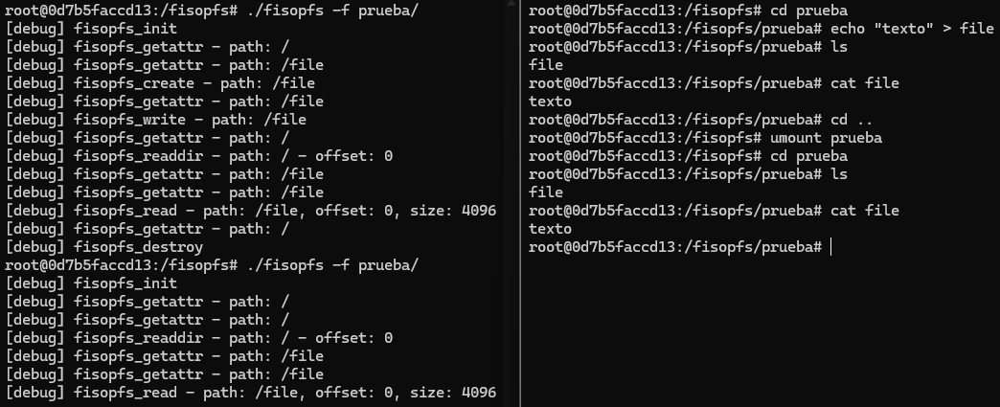

### rm

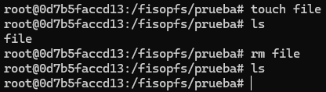

### rmdir con contenido

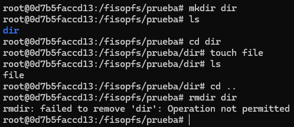

### rmdir sin contenido

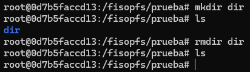

### Sobreescribir archivo

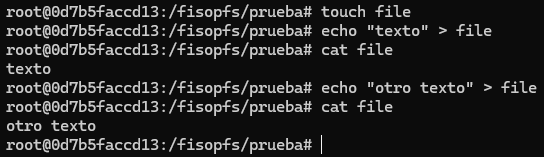

### stat

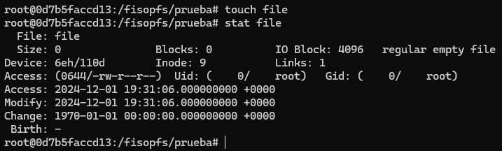